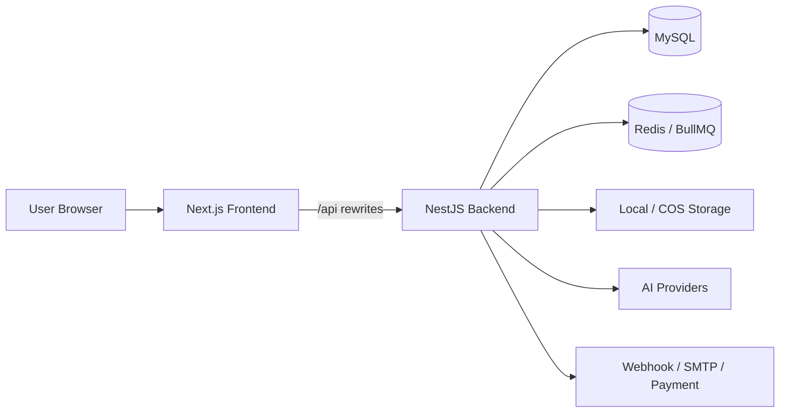

<div align="center">

# FlowMuse

面向 AI 创作者与运营团队的一体化创作平台，集 Agent 助手、自动工作流、项目管理、图片 / 视频生成、作品画廊与商业化后台于一体。

[](https://nextjs.org/)
[](https://react.dev/)
[](https://nestjs.com/)
[](https://www.prisma.io/)
[](https://docs.docker.com/compose/)
[](https://www.typescriptlang.org/)

</div>

---

## Overview

FlowMuse 不是单纯的 AI 图片 / 视频生成站点，而是围绕完整创作链路设计的 AI Creative Workflow Platform。它把对话式需求收集、Agent 自动追问、项目资产管理、提示词沉淀、生成任务、作品发布和运营后台连接成一个闭环。

适合用于：

- AI 图片 / 视频生成平台
- 创作者作品展示和画廊社区
- 面向项目的多轮 AI 创作工作流
- 带会员、积分、套餐、兑换码和后台审核的商业化平台

## Highlights

### Agent 与自动工作流

- **对话式创作 Agent**：在聊天中理解用户目标，自动追问主题、风格、比例、角色、场景、镜头语言和参考素材。
- **自动项目工作流**：将一次创作拆解为项目描述、灵感、项目资产、图片提示词、视频提示词和生成任务。
- **多模态上下文**：支持图片、文档、生成结果作为上下文，围绕已有素材继续创作。
- **任务联动**：在聊天中直接创建图片 / 视频任务，生成结果可回流项目资产库。
- **联网与文件解析**：支持 web search、文件上传和内容解析，适合研究型创作。

### 项目管理

- **项目资产库**：统一管理图片、视频和文档素材。
- **灵感管理**：围绕项目沉淀灵感、描述、风格方向和创作参考。
- **提示词管理**：维护图片提示词、视频提示词和项目级提示词。
- **连续创作**：支持从概念设定到多轮生成、视频化、整理发布的长周期流程。
- **后台治理**：管理员可查看项目数据并配置项目相关额度策略。

### 生成、画廊与运营

- **图片生成**：模型选择、参数配置、任务历史、重试、删除、公开发布和 Midjourney 动作。
- **视频生成**：视频任务、Seedance 输入上传、取消、重试、公开发布和任务管理。
- **公共画廊**：瀑布流作品、图片 / 视频详情、点赞、收藏、评论、搜索和个人作品页。
- **会员积分**：套餐、会员等级、会员排期、积分流水、兑换码、邀请奖励和聊天模型额度。
- **运营后台**：用户、模型、渠道、任务、项目、套餐、订单、模板、工具、公告、站点配置和审核管理。

## Tech Stack

| Layer | Stack |
| --- | --- |
| Frontend | Next.js 15 App Router, React 19, TypeScript, Tailwind CSS, Radix UI, Framer Motion |
| State & i18n | Zustand, React Hook Form, Zod, next-intl |
| Backend | NestJS 10, Prisma 5, JWT, Passport, BullMQ |
| Data | MySQL 8, Redis 7 |
| Storage | Local storage, Tencent Cloud COS |
| Workers | Image task, Video task, Email, Research, Queue throttling |
| Deployment | Docker Compose, Docker Hub images, Next.js standalone |

## Architecture



## Quick Deploy

FlowMuse 默认使用 Docker Hub 上的预构建镜像：

```text
hjxwz123/flowmuse-backend:latest
hjxwz123/flowmuse-frontend:latest
```

你只需要一个 `docker-compose.yml` 文件即可部署。

### 1. 准备目录

```bash
mkdir flowmuse
cd flowmuse
# 将 docker-compose.yml 放到当前目录
```

### 2. 启动

```bash
docker compose up -d
```

旧版 Docker Compose：

```bash
docker-compose up -d
```

默认访问地址：

| Service | URL |
| --- | --- |
| Frontend | `http://localhost:3001` |
| Backend API | `http://localhost:3000/api` |
| MySQL | `localhost:3306` |
| Redis | `localhost:6379` |

### 3. 初始化管理员

首次启动后执行一次：

```bash
docker compose exec backend npm run prisma:seed
```

旧版 Docker Compose：

```bash
docker-compose exec backend npm run prisma:seed
```

默认账号：

```text
Email: admin@example.com
Password: admin123456
```

首次登录后请立即修改默认密码。

## Production Configuration

`docker-compose.yml` 内置默认密码和密钥，便于快速体验。生产环境建议创建 `.env` 文件覆盖默认值。

在 `docker-compose.yml` 同目录创建 `.env`：

```bash
MYSQL_ROOT_PASSWORD=your_root_password
MYSQL_PASSWORD=your_db_password
JWT_ACCESS_SECRET=your_access_secret
JWT_REFRESH_SECRET=your_refresh_secret
APP_ENCRYPTION_KEY=your_32_chars_min_key
APP_PUBLIC_URL=http://your-server-ip:3000
FRONTEND_URL=http://your-server-ip:3001
```

然后启动：

```bash
docker compose up -d
```

也可以直接用环境变量启动：

```bash
MYSQL_ROOT_PASSWORD=your_root_password \
MYSQL_PASSWORD=your_db_password \
JWT_ACCESS_SECRET=your_access_secret \
JWT_REFRESH_SECRET=your_refresh_secret \
APP_ENCRYPTION_KEY=your_32_chars_min_key \
APP_PUBLIC_URL=http://your-server-ip:3000 \
FRONTEND_URL=http://your-server-ip:3001 \
docker compose up -d
```

## Docker Operations

```bash
# 查看容器状态
docker compose ps

# 查看日志
docker compose logs -f

# 拉取最新镜像
docker compose pull

# 重启服务
docker compose up -d

# 停止服务
docker compose down

# 停止并删除数据卷，慎用
docker compose down -v
```

## Publish Images

如果你维护自己的镜像，可以在项目根目录构建并推送。

### Docker Hub

```bash
docker login -u hjxwz123

# Backend
docker buildx build \
  --platform linux/amd64 \
  -f Dockerfile.backend \
  -t hjxwz123/flowmuse-backend:latest \
  --push \
  .

# Frontend
docker buildx build \
  --platform linux/amd64 \
  -f Dockerfile.frontend \
  --build-arg NEXT_PUBLIC_API_BASE_URL=/api \
  --build-arg BACKEND_URL=http://backend:3000 \
  -t hjxwz123/flowmuse-frontend:latest \
  --push \
  .
```

### Versioned Release

```bash
VERSION=1.0.0

docker buildx build \
  --platform linux/amd64 \
  -f Dockerfile.backend \
  -t hjxwz123/flowmuse-backend:$VERSION \
  -t hjxwz123/flowmuse-backend:latest \
  --push \
  .

docker buildx build \
  --platform linux/amd64 \
  -f Dockerfile.frontend \
  --build-arg NEXT_PUBLIC_API_BASE_URL=/api \
  --build-arg BACKEND_URL=http://backend:3000 \
  -t hjxwz123/flowmuse-frontend:$VERSION \
  -t hjxwz123/flowmuse-frontend:latest \
  --push \
  .
```

## Local Development

云端部署不需要本地开发环境。如果你要二次开发，请使用源码启动。

```bash
npm install
cd frontend && npm install && cd ..

cp .env.example .env
cp frontend/.env.example frontend/.env.local

npm run prisma:generate
npm run prisma:migrate
npm run prisma:seed
npm run dev:all
```

开发地址：

- Frontend: `http://localhost:5173`
- Backend API: `http://localhost:3000/api`

## Common Commands

| Command | Description |
| --- | --- |
| `docker compose up -d` | Start cloud deployment |
| `docker compose pull` | Pull latest images |
| `docker compose logs -f` | Follow logs |
| `docker compose exec backend npm run prisma:seed` | Seed default admin user |
| `npm run dev:all` | Start local development |
| `npm run build:all` | Build backend and frontend locally |
| `cd frontend && npm run type-check` | Run frontend type check |

## Project Structure

```text
flowmuse/
├── src/                    # NestJS backend: auth, chat, projects, images, videos, gallery, admin
├── frontend/               # Next.js frontend: pages, components, API client, store, i18n
├── prisma/                 # Prisma schema, migrations and seed
├── Dockerfile.backend      # Backend image build file
├── Dockerfile.frontend     # Frontend image build file
├── docker-compose.yml      # Single-file cloud deployment
└── README.md
```

## Environment Variables

| Variable | Description |
| --- | --- |
| `MYSQL_ROOT_PASSWORD` | MySQL root password |
| `MYSQL_DATABASE` | MySQL database name, default `flowmuse` |
| `MYSQL_USER` / `MYSQL_PASSWORD` | MySQL app user and password |
| `JWT_ACCESS_SECRET` / `JWT_REFRESH_SECRET` | JWT signing secrets |
| `APP_ENCRYPTION_KEY` | Sensitive data encryption key, at least 32 chars |
| `APP_PUBLIC_URL` / `FRONTEND_URL` | Public backend and frontend URLs |
| `STORAGE_DRIVER` | `local` or `cos` |
| `COS_*` | Tencent Cloud COS configuration |
| `SMTP_*` | Email configuration |
| `OPENAI_DEEP_RESEARCH_API_KEY` | External deep research API bearer token |

## Security Notes

- Do not commit `.env`, `frontend/.env.local` or real secrets.
- Replace default database passwords, JWT secrets, encryption key and default admin password in production.
- Do not expose MySQL and Redis publicly unless you know what you are doing.
- Prefer HTTPS reverse proxy in front of the frontend service.
- Use least-privilege credentials for COS, SMTP and payment integrations.

## Roadmap

- [ ] Configurable Agent workflow templates
- [ ] More AI provider presets
- [ ] OpenAPI / Swagger documentation
- [ ] Automated test coverage
- [ ] Team collaboration and multi-tenant support

## License

ISC
