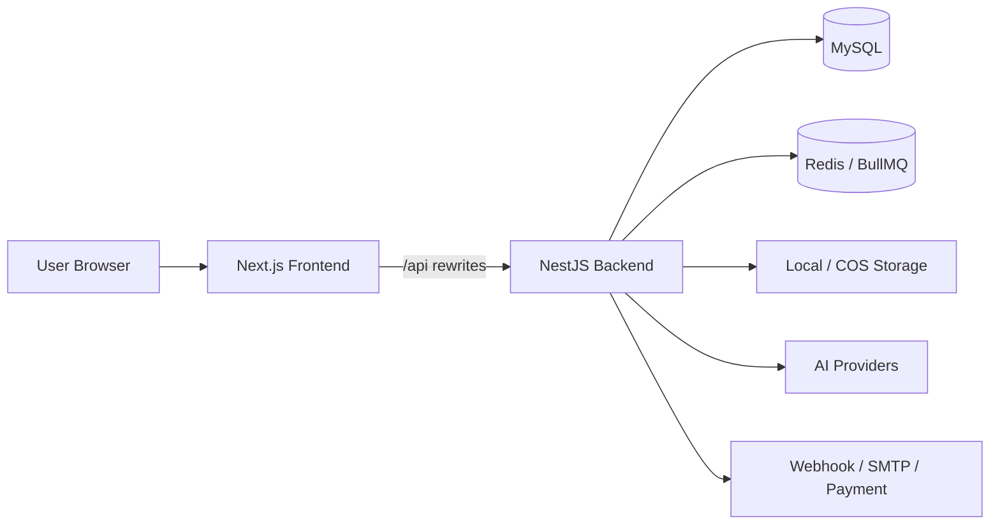

<div align="center">

# FlowMuse

面向 AI 创作者与运营团队的一体化创作平台：自动工作流、Agent 助手、项目资产管理、图片 / 视频生成、公共画廊与商业化后台。

[](https://nextjs.org/)
[](https://react.dev/)
[](https://nestjs.com/)
[](https://www.prisma.io/)
[](https://docs.docker.com/compose/)
[](https://www.typescriptlang.org/)

</div>

---

## 为什么是 FlowMuse

FlowMuse 不只是一个“生成图片 / 视频”的站点。它围绕真实创作链路设计：从对话式需求收集、Agent 自动追问、素材上传与解析，到项目资产沉淀、提示词管理、图片 / 视频任务生成、画廊发布和后台运营管理，形成完整闭环。

## 核心能力

### 自动工作流与 Agent

- **对话式创作 Agent**：在聊天中理解用户目标，自动追问主题、风格、比例、角色、场景、镜头、参考素材等关键参数。
- **自动项目工作流**：将一次创作拆解为项目描述、灵感、资产、图片提示词、视频提示词和生成任务，减少手工整理成本。
- **多模态上下文**：支持上传图片、文档与生成结果作为上下文，Agent 可围绕已有素材继续推进创作。
- **任务联动**：聊天中可直接创建图片 / 视频任务，生成结果可回流到项目资产库与画廊。
- **联网与文件解析**：内置 web search 服务与文件解析能力，支持更丰富的研究和创作参考。

### 项目管理

- **项目资产库**：集中管理图片、视频、文档等素材，支持上传、导入任务结果和复用已有作品。
- **灵感与提示词管理**：围绕项目维护灵感、图片提示词、视频提示词、描述和分镜素材。
- **连续创作流程**：适合从概念设定到多轮生成、视频化、整理发布的长周期创作。
- **项目后台治理**：管理员可查看项目数据，并配置项目免费额度等运营策略。

### AI 生成与内容展示

- **图片生成**：支持模型选择、参数配置、任务历史、重试、删除、公开发布和 Midjourney 交互动作。
- **视频生成**：支持视频任务、Seedance 输入上传、取消、重试、公开发布和任务管理。
- **公共画廊**：瀑布流作品展示、图片 / 视频详情页、点赞、收藏、评论、搜索与个人作品页。
- **任务中心**：统一查看图片、视频等生成任务状态。

### 商业化与运营后台

- **会员与积分**：套餐、会员等级、会员排期、积分流水、兑换码、邀请奖励和聊天模型额度。
- **支付与订单**：内置订单模型和微信支付回调入口，可按业务继续扩展支付渠道。
- **内容运营**：公告、站点弹窗、模板市场、工具导航、站点标题、图标、页脚、主题色配置。
- **安全审核**：画廊审核、聊天审核、输入审核日志和用户封禁能力。
- **管理面板**：用户、模型、渠道、任务、项目、套餐、会员、订单、模板、工具和站点配置统一管理。

## 技术栈

| 层 | 技术 |
| --- | --- |
| Frontend | Next.js 15 App Router, React 19, TypeScript, Tailwind CSS, Radix UI, Framer Motion |
| State & i18n | Zustand, React Hook Form, Zod, next-intl |
| Backend | NestJS 10, Prisma 5, JWT, Passport, BullMQ |
| Data | MySQL 8, Redis 7 |
| Storage | Local storage, Tencent Cloud COS |
| Workers | Image task, Video task, Email, Research, Queue throttling |
| Deployment | Docker Compose, cloud container images, Next.js standalone |

## 系统架构



## 云端 Docker 部署

本项目默认推荐使用**已上传到镜像仓库的云端 Docker 镜像**部署。部署者不需要本地构建源码，只需要 `docker-compose.yml` 和 `.env.docker`。

### 1. 准备配置

```bash
cp .env.docker.example .env.docker
```

编辑 `.env.docker`，至少修改：

```bash
BACKEND_IMAGE=ghcr.io/your-username/flowmuse-backend:latest
FRONTEND_IMAGE=ghcr.io/your-username/flowmuse-frontend:latest
MYSQL_ROOT_PASSWORD=change_root_password
MYSQL_PASSWORD=change_db_password
JWT_ACCESS_SECRET=change-me-to-random-string
JWT_REFRESH_SECRET=change-me-to-another-random-string
APP_ENCRYPTION_KEY=change-me-32-bytes-minimum-length
APP_PUBLIC_URL=http://your-domain-or-ip:3000
FRONTEND_URL=http://your-domain-or-ip:3001
```

### 2. 启动服务

```bash
docker compose --env-file .env.docker up -d
```

默认端口：

| 服务 | 地址 |
| --- | --- |
| Frontend | `http://localhost:3001` |
| Backend API | `http://localhost:3000/api` |
| MySQL | `localhost:3306` |
| Redis | `localhost:6379` |

### 3. 初始化管理员

首次启动后执行一次：

```bash
docker compose --env-file .env.docker exec backend npm run prisma:seed
```

默认管理员：

```text
Email: admin@example.com
Password: admin123456
```

首次登录后请立即修改默认密码。

### 4. 查看日志与更新

```bash
# 查看日志
docker compose --env-file .env.docker logs -f

# 拉取新镜像并重启
docker compose --env-file .env.docker pull
docker compose --env-file .env.docker up -d

# 停止服务
docker compose --env-file .env.docker down
```

## 发布自己的云端镜像

如果你维护自己的镜像仓库，可以在项目根目录构建并推送两个镜像。

### Docker Hub 示例

```bash
# 登录
docker login

# 构建后端
docker build -f Dockerfile.backend -t yourname/flowmuse-backend:latest .

# 构建前端
docker build \
  -f Dockerfile.frontend \
  --build-arg NEXT_PUBLIC_API_BASE_URL=/api \
  --build-arg BACKEND_URL=http://backend:3000 \
  -t yourname/flowmuse-frontend:latest .

# 推送
docker push yourname/flowmuse-backend:latest
docker push yourname/flowmuse-frontend:latest
```

然后修改 `.env.docker`：

```bash
BACKEND_IMAGE=yourname/flowmuse-backend:latest
FRONTEND_IMAGE=yourname/flowmuse-frontend:latest
```

### GitHub Container Registry 示例

```bash
docker login ghcr.io

docker build -f Dockerfile.backend -t ghcr.io/your-username/flowmuse-backend:latest .
docker build \
  -f Dockerfile.frontend \
  --build-arg NEXT_PUBLIC_API_BASE_URL=/api \
  --build-arg BACKEND_URL=http://backend:3000 \
  -t ghcr.io/your-username/flowmuse-frontend:latest .

docker push ghcr.io/your-username/flowmuse-backend:latest
docker push ghcr.io/your-username/flowmuse-frontend:latest
```

## 本地开发

云端部署不需要本地开发环境。如果你要二次开发，请使用源码启动。

```bash
npm install
cd frontend && npm install && cd ..

cp .env.example .env
cp frontend/.env.example frontend/.env.local

npm run prisma:generate
npm run prisma:migrate
npm run prisma:seed
npm run dev:all
```

开发地址：

- Frontend: `http://localhost:5173`
- Backend API: `http://localhost:3000/api`

## 常用命令

| 命令 | 说明 |
| --- | --- |
| `docker compose --env-file .env.docker up -d` | 云端镜像部署启动 |
| `docker compose --env-file .env.docker pull` | 拉取最新镜像 |
| `docker compose --env-file .env.docker logs -f` | 查看日志 |
| `docker compose --env-file .env.docker exec backend npm run prisma:seed` | 初始化默认管理员 |
| `npm run dev:all` | 本地源码开发启动 |
| `npm run build:all` | 本地构建前后端 |
| `cd frontend && npm run type-check` | 前端类型检查 |

## 目录结构

```text
flowmuse/
├── src/                    # NestJS 后端：auth、chat、projects、images、videos、gallery、admin 等
├── frontend/               # Next.js 前端：页面、组件、API client、store、i18n
├── prisma/                 # 数据模型、迁移和 seed
├── Dockerfile.backend      # 后端镜像构建文件
├── Dockerfile.frontend     # 前端镜像构建文件
├── docker-compose.yml      # 云端镜像部署编排
├── .env.docker.example     # Docker 部署环境变量模板
└── README.md
```

## 重要环境变量

| 变量 | 说明 |
| --- | --- |
| `BACKEND_IMAGE` / `FRONTEND_IMAGE` | 后端 / 前端云端镜像地址 |
| `DATABASE_URL` | MySQL 连接字符串，Docker 内部默认指向 `mysql` 服务 |
| `REDIS_HOST` / `REDIS_PORT` | Redis 连接配置 |
| `JWT_ACCESS_SECRET` / `JWT_REFRESH_SECRET` | JWT 签名密钥，生产环境必须替换 |
| `APP_ENCRYPTION_KEY` | 敏感数据加密密钥，至少 32 字节 |
| `STORAGE_DRIVER` | `local` 或 `cos` |
| `COS_*` | 腾讯云 COS 配置 |
| `SMTP_*` | 邮件发送配置 |
| `APP_PUBLIC_URL` / `FRONTEND_URL` | 后端和前端公网地址 |
| `BACKEND_URL` | 前端容器访问后端的内部地址，Docker 中通常为 `http://backend:3000` |
| `NEXT_PUBLIC_API_BASE_URL` | 前端 API 路径，推荐 `/api` |

## 安全建议

- 不要提交 `.env`、`.env.docker`、`frontend/.env.local` 或任何真实密钥。
- 生产环境必须替换默认数据库密码、JWT 密钥、加密密钥和默认管理员密码。
- 建议通过 HTTPS 反向代理暴露前端服务，并限制 MySQL / Redis 公网访问。
- 如果使用 COS、SMTP、支付等第三方服务，请使用最小权限密钥。

## Roadmap

- [ ] 增强 Agent 工作流模板配置
- [ ] 增加更多 AI Provider 预设
- [ ] 完善 OpenAPI / Swagger 文档
- [ ] 增加自动化测试覆盖
- [ ] 扩展团队协作与多租户能力

## License

ISC
