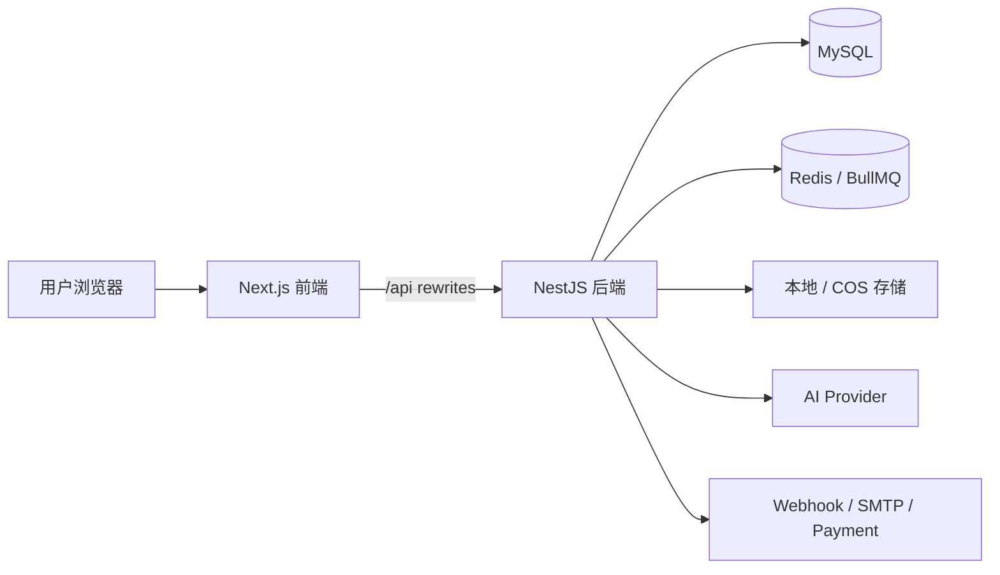

<div align="center">

# FlowMuse

面向 AI 创作者与运营团队的一体化创作平台，集 Agent 助手、自动工作流、项目管理、图片 / 视频生成、作品画廊与商业化后台于一体。

[](https://nextjs.org/)
[](https://react.dev/)
[](https://nestjs.com/)
[](https://www.prisma.io/)
[](https://docs.docker.com/compose/)
[](https://www.typescriptlang.org/)

</div>

---

## 项目简介

FlowMuse 不是单纯的 AI 图片 / 视频生成站点，而是围绕完整创作链路设计的 AI 创作工作流平台。它把对话式需求收集、Agent 自动追问、项目资产管理、提示词沉淀、图片 / 视频任务生成、作品发布和运营后台连接成一个闭环。

适合用于：

- AI 图片 / 视频生成平台
- 创作者作品展示和画廊社区
- 面向项目的多轮 AI 创作工作流
- 带会员、积分、套餐、兑换码和后台审核的商业化平台

## 核心亮点

### Agent 与自动工作流

- **对话式创作 Agent**：在聊天中理解用户目标，自动追问主题、风格、比例、角色、场景、镜头语言和参考素材。
- **自动项目工作流**：将一次创作拆解为项目描述、灵感、项目资产、图片提示词、视频提示词和生成任务。
- **多模态上下文**：支持图片、文档、生成结果作为上下文，围绕已有素材继续创作。
- **任务联动**：在聊天中直接创建图片 / 视频任务，生成结果可回流项目资产库。
- **联网与文件解析**：支持 web search、文件上传和内容解析，适合研究型创作。

### 项目管理

- **项目资产库**：统一管理图片、视频和文档素材。
- **灵感管理**：围绕项目沉淀灵感、描述、风格方向和创作参考。
- **提示词管理**：维护图片提示词、视频提示词和项目级提示词。
- **连续创作**：支持从概念设定到多轮生成、视频化、整理发布的长周期流程。
- **后台治理**：管理员可查看项目数据并配置项目相关额度策略。

### 生成、画廊与运营

- **图片生成**：模型选择、参数配置、任务历史、重试、删除、公开发布和 Midjourney 动作。
- **视频生成**：视频任务、Seedance 输入上传、取消、重试、公开发布和任务管理。
- **公共画廊**：瀑布流作品、图片 / 视频详情、点赞、收藏、评论、搜索和个人作品页。
- **会员积分**：套餐、会员等级、会员排期、积分流水、兑换码、邀请奖励和聊天模型额度。
- **运营后台**：用户、模型、渠道、任务、项目、套餐、订单、模板、工具、公告、站点配置和审核管理。

## 技术栈

| 层 | 技术 |
| --- | --- |
| 前端 | Next.js 15 App Router、React 19、TypeScript、Tailwind CSS、Radix UI、Framer Motion |
| 状态与表单 | Zustand、React Hook Form、Zod、next-intl |
| 后端 | NestJS 10、Prisma 5、JWT、Passport、BullMQ |
| 数据 | MySQL 8、Redis 7 |
| 存储 | 本地存储、腾讯云 COS |
| 队列任务 | 图片任务、视频任务、邮件、深度研究、队列限流 |
| 部署 | Docker Compose、Docker Hub 镜像、Next.js standalone |

## 系统架构



## 快速部署

FlowMuse 默认使用 Docker Hub 上的预构建镜像：

```text
hjxwz123/flowmuse-backend:latest
hjxwz123/flowmuse-frontend:latest
```

你只需要一个 `docker-compose.yml` 文件即可部署。

### 1. 准备目录

```bash
mkdir flowmuse
cd flowmuse
# 将 docker-compose.yml 放到当前目录
```

### 2. 启动服务

默认映射：

```bash
docker compose up -d
```

默认只暴露前后端端口：

| 服务 | 地址 |
| --- | --- |
| 前端 | `http://localhost:3001` |
| 后端 API | `http://localhost:3000/api` |

MySQL 和 Redis 只在 Docker 内部网络使用，不映射到宿主机，因此不会占用服务器已有的 `3306` / `6379`。

### 3. 使用 6000 / 6001 端口启动

如果你希望映射到服务器 `6000` / `6001`：

```bash
BACKEND_PORT=6000 \
FRONTEND_PORT=6001 \
docker compose up -d
```

访问地址：

```text
前端：http://服务器IP:6001
后端：http://服务器IP:6000/api
```

如果绑定域名，建议同时配置公网地址：

```bash
BACKEND_PORT=6000 \
FRONTEND_PORT=6001 \
APP_PUBLIC_URL=https://api.example.com \
FRONTEND_URL=https://example.com \
docker compose up -d
```

如果前后端共用一个域名，也可以：

```bash
APP_PUBLIC_URL=https://example.com
FRONTEND_URL=https://example.com
```

### 4. 初始化管理员

首次启动后执行一次：

```bash
docker compose exec backend npm run prisma:seed
```

默认账号：

```text
Email: admin@example.com
Password: admin123456
```

首次登录后请立即修改默认密码。

## 生产环境配置

`docker-compose.yml` 内置默认密码和密钥，便于快速体验。生产环境建议在同目录创建 `.env` 文件覆盖默认值。

示例 `.env`：

```bash
MYSQL_ROOT_PASSWORD=your_root_password
MYSQL_PASSWORD=your_db_password
JWT_ACCESS_SECRET=your_access_secret
JWT_REFRESH_SECRET=your_refresh_secret
APP_ENCRYPTION_KEY=your_32_chars_min_key
BACKEND_PORT=6000
FRONTEND_PORT=6001
APP_PUBLIC_URL=https://api.example.com
FRONTEND_URL=https://example.com
```

创建 `.env` 后直接启动：

```bash
docker compose up -d
```

> Docker Compose 会自动读取同目录下的 `.env` 文件。

## 数据持久化

FlowMuse 使用本地目录挂载保存运行数据，服务器重启或容器重建后数据不会丢失。

```text
flowmuse/
├── docker-compose.yml
└── data/
    ├── mysql/      # MySQL 数据库文件
    ├── redis/      # Redis 持久化数据
    └── uploads/    # 本地上传文件
```

挂载关系：

| 本地路径 | 容器路径 | 说明 |
| --- | --- | --- |
| `./data/mysql` | `/var/lib/mysql` | MySQL 数据库文件 |
| `./data/redis` | `/data` | Redis 持久化数据 |
| `./data/uploads` | `/app/uploads` | 本地上传文件 |

备份数据：

```bash
tar -czf flowmuse-data-$(date +%Y%m%d).tar.gz data/
```

恢复数据：

```bash
docker compose down
tar -xzf flowmuse-data-YYYYMMDD.tar.gz
docker compose up -d
```

注意：不要删除 `data/` 目录；不要执行会清理项目目录数据的命令。

## Docker 运维命令

```bash
# 查看容器状态
docker compose ps

# 查看日志
docker compose logs -f

# 只看后端日志
docker compose logs -f backend

# 只看前端日志
docker compose logs -f frontend

# 拉取最新镜像
docker compose pull

# 重启服务
docker compose up -d

# 停止服务，data/ 数据仍保留
docker compose down
```

不要在生产环境随意执行：

```bash
docker compose down -v
```

`-v` 会删除 Docker volume。当前项目主要使用 `./data` 目录挂载，但仍建议避免误操作。

## 数据库迁移说明

后端容器启动前会自动执行：

```bash
prisma migrate deploy
```

这意味着：

- 首次部署会自动创建数据库表。
- 后续版本如果包含新的 Prisma migration，容器启动时会自动应用。
- 如果你已经有生产数据，不要手动删除 `data/mysql`。
- 如果是全新测试环境需要重置数据库，可以停止服务后删除 `data/mysql` 再启动。

重置测试数据库：

```bash
docker compose down
rm -rf ./data/mysql
docker compose up -d
```

## 发布 Docker 镜像

如果你维护自己的镜像，可以在项目根目录构建并推送。

### 发布 latest

```bash
docker login -u hjxwz123

# 后端
docker buildx build \
  --platform linux/amd64 \
  -f Dockerfile.backend \
  -t hjxwz123/flowmuse-backend:latest \
  --push \
  .

# 前端
docker buildx build \
  --platform linux/amd64 \
  -f Dockerfile.frontend \
  --build-arg NEXT_PUBLIC_API_BASE_URL=/api \
  --build-arg BACKEND_URL=http://backend:3000 \
  -t hjxwz123/flowmuse-frontend:latest \
  --push \
  .
```

### 发布版本号

```bash
VERSION=1.0.0

docker buildx build \
  --platform linux/amd64 \
  -f Dockerfile.backend \
  -t hjxwz123/flowmuse-backend:$VERSION \
  -t hjxwz123/flowmuse-backend:latest \
  --push \
  .

docker buildx build \
  --platform linux/amd64 \
  -f Dockerfile.frontend \
  --build-arg NEXT_PUBLIC_API_BASE_URL=/api \
  --build-arg BACKEND_URL=http://backend:3000 \
  -t hjxwz123/flowmuse-frontend:$VERSION \
  -t hjxwz123/flowmuse-frontend:latest \
  --push \
  .
```

## 本地开发

云端部署不需要本地开发环境。如果你要二次开发，请使用源码启动。

```bash
npm install
cd frontend && npm install && cd ..

cp .env.example .env
cp frontend/.env.example frontend/.env.local

npm run prisma:generate
npm run prisma:migrate
npm run prisma:seed
npm run dev:all
```

开发地址：

- 前端：`http://localhost:5173`
- 后端 API：`http://localhost:3000/api`

## 常用命令

| 命令 | 说明 |
| --- | --- |
| `docker compose up -d` | 启动云端部署 |
| `docker compose pull` | 拉取最新镜像 |
| `docker compose logs -f` | 查看实时日志 |
| `docker compose exec backend npm run prisma:seed` | 初始化默认管理员 |
| `npm run dev:all` | 启动本地开发环境 |
| `npm run build:all` | 本地构建前后端 |
| `cd frontend && npm run type-check` | 前端类型检查 |

## 项目结构

```text
flowmuse/
├── src/                    # NestJS 后端：auth、chat、projects、images、videos、gallery、admin
├── frontend/               # Next.js 前端：页面、组件、API client、store、i18n
├── prisma/                 # Prisma schema、migration 和 seed
├── Dockerfile.backend      # 后端镜像构建文件
├── Dockerfile.frontend     # 前端镜像构建文件
├── docker-compose.yml      # 单文件云端部署配置
├── data/                   # 运行数据：mysql、redis、uploads
└── README.md
```

## 环境变量

| 变量 | 说明 |
| --- | --- |
| `MYSQL_ROOT_PASSWORD` | MySQL root 密码 |
| `MYSQL_DATABASE` | MySQL 数据库名，默认 `flowmuse` |
| `MYSQL_USER` / `MYSQL_PASSWORD` | MySQL 应用用户和密码 |
| `JWT_ACCESS_SECRET` / `JWT_REFRESH_SECRET` | JWT 签名密钥 |
| `APP_ENCRYPTION_KEY` | 敏感数据加密密钥，至少 32 字符 |
| `BACKEND_PORT` / `FRONTEND_PORT` | 宿主机暴露的后端 / 前端端口 |
| `APP_PUBLIC_URL` / `FRONTEND_URL` | 后端 / 前端公网地址 |
| `STORAGE_DRIVER` | `local` 或 `cos` |
| `COS_*` | 腾讯云 COS 配置 |
| `SMTP_*` | 邮件发送配置 |
| `OPENAI_DEEP_RESEARCH_API_KEY` | 外部深度研究 API Bearer Token |

## 安全建议

- 不要提交 `.env`、`frontend/.env.local` 或任何真实密钥。
- 生产环境必须替换默认数据库密码、JWT 密钥、加密密钥和默认管理员密码。
- MySQL 和 Redis 默认不暴露到宿主机，请保持内部访问。
- 推荐使用 Nginx / Caddy 等反向代理，并为前端域名启用 HTTPS。
- 使用 COS、SMTP、支付等第三方服务时，请使用最小权限密钥。

## Roadmap

- [ ] 可配置 Agent 工作流模板
- [ ] 更多 AI Provider 预设
- [ ] OpenAPI / Swagger 文档
- [ ] 自动化测试覆盖
- [ ] 团队协作与多租户能力

## License

ISC
